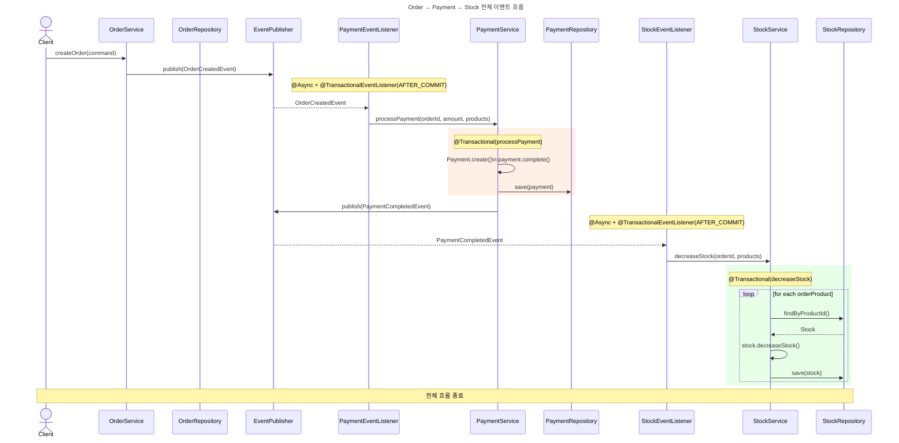

## 이벤트 아키텍처 적용

---
### 이벤트 플로우 다이어그램 
1. 주문 생성: 주문 생성시, 트랜잭션이 성공적으로 완료(COMMIT)된 후 OrderCreatedEvent 발행
2. 결제 처리: PaymentEventListener가 이벤트를 수신하여 PaymentService의 processPayment를 비동기(@Async)로 호출
3. 결제 완료: 결제 로직이 성공적으로 처리되고 트랜잭션이 완료되면, PaymentService는 PaymentCompletedEvent를 발행
4. 재고 차감: StockEventListener가 결제 완료 이벤트를 수신하여 StockService의 decreaseStock을 비동기(@Async)로 호출, 주문된 상품 재고 차감



---
## 실행 방법
```bash
./gradlew clean build
./gradlew bootRun
./gradlew test --tests "com.jumunhasyeotjo.order_to_shipping.order.event.*"
```
---
## 회고 
Event + EventListener 를 통한 기본적인 이벤트 통신 구조 자체를 이해하는데에는 어려움이 없었지만
이벤트 아키텍처를 통해서 다른 도메인간 통신의 흐름을 설계하고, 통신시 동기/비동기 설정을 적용할 시점을
구분하는데 어려움이 있었다.

이번 과제를 통해 이벤트 아키텍처를 사용할시의 이점에 대해서 알게되었고, 반드시 이벤트 아키텍처를 도입하는 것이
좋지만은 않을수 있겠다는 점 또한 알게되었다.


